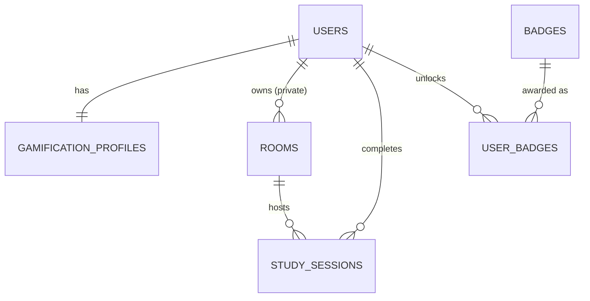

# Database — Focoya (v1)

- **DBMS:** PostgreSQL 15 (deploy lên Supabase).
- **Migration:** Flyway. Schema nằm ở [`V1__init_schema.sql`](../../backend/study-room-backend/src/main/resources/db/migration/V1__init_schema.sql).
- **Hibernate:** `ddl-auto: validate`. Hibernate không tự tạo bảng, chỉ kiểm tra entity khớp schema.
- **ERD:** [`erd.dbml`](erd.dbml), dán vào [dbdiagram.io](https://dbdiagram.io) để xem và xuất ảnh.

## Sơ đồ quan hệ

## Các bảng

| Bảng | Mục đích | Ghi chú quan trọng |
|---|---|---|
| `users` | Tài khoản + profile | Tên `users` vì `user` là từ khóa của PostgreSQL. Không trả `password_hash` ra API. |
| `gamification_profiles` | XP, streak, daily goal (1-1 với user) | **Level không lưu**, tính từ `total_xp`. |
| `rooms` | Public room (seed, `owner_id = NULL`) và private room | Private room bắt buộc có `owner_id` + `invite_code` (CHECK constraint). Không xóa cứng, dùng `is_active`. |
| `study_sessions` | Mỗi phiên học / Pomodoro là 1 dòng | `started_at`, `ended_at`, `duration_minutes`, `xp_earned` do **server** tính. Mỗi user chỉ có tối đa 1 session `IN_PROGRESS` (partial unique index). |
| `badges` | Danh mục huy hiệu | Seed thuộc TSK-26. |
| `user_badges` | User đã mở khóa badge nào | `UNIQUE(user_id, badge_id)` nên mở khóa idempotent. |

**Không lưu trong DB:** presence (ai đang online, trạng thái STUDYING/BREAK/IDLE). Dữ liệu này nằm in-memory ở backend.

## Quy tắc khi đổi schema

1. **Không sửa** file migration đã merge (Flyway lưu checksum, sửa là app không khởi động).
2. Tạo file mới `V2__mo_ta_ngan.sql`, `V3__...` trong `db/migration`.
3. Cập nhật entity Java cho khớp, chạy `./mvnw test` để Hibernate validate.
4. Cập nhật `erd.dbml` và file này.

## Điểm cần nhóm xác nhận

- **`study_sessions.xp_earned`**: lưu XP của từng session để leaderboard tuần tính được `weeklyXP` bằng `SUM`. Bonus daily goal (+50 XP, TSK-25) hiện **chưa có chỗ lưu theo ngày**, nên nếu leaderboard tính theo weeklyXP thì bonus sẽ không được cộng vào. Tiên cần chốt.
- **Streak theo timezone** (TSK-25): DB lưu thời gian dạng UTC (`timestamptz`). Đề xuất tính "ngày" theo múi giờ `Asia/Ho_Chi_Minh` ở tầng service.
- **Room tags** (TSK-12 có nhắc): chưa có cột. Thêm ở V2 nếu FE cần filter theo tag.
